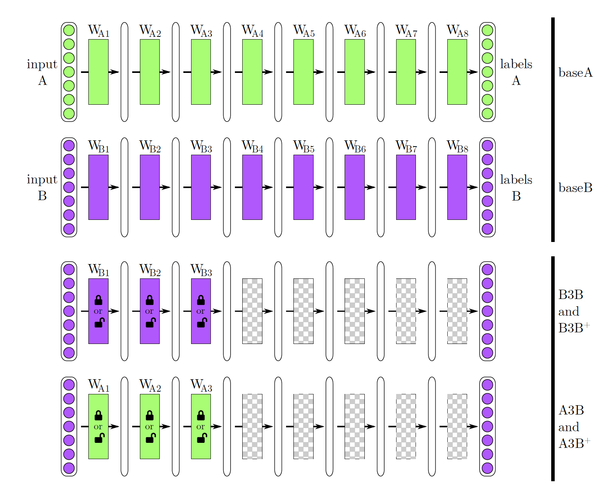
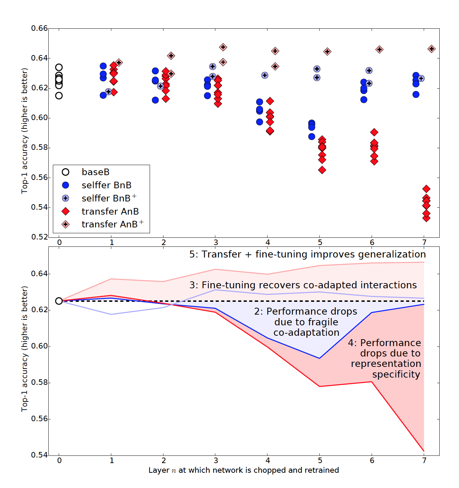
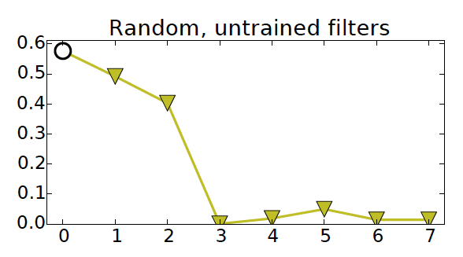
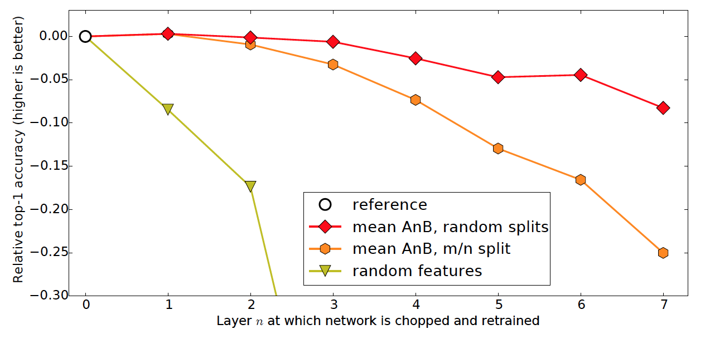

# Explore feature transfer in deep neural networks

Related paper: [How Transferable are Features in Deep Neural Networks][Paper Link] by Jason Yosinski et al.

It's common to transfer features from a model trained on a large dataset to a small dataset for a similar task. Yet how should we quantify the transferability between datasets and tasks? Which layers of model are "general" enough for us to transfer and which are not? The publication [How Transferable are Features in Deep Neural Networks][Paper Link] composed by Jason Yosinski et al. addressed these questions through the comparison between models of same structure trained on different ImageNet subsets.

## General or Specific?
When we are transferring features between networks trained for different tasks, we always need to consider whether these features are "general" enough for a successful transfer. In other words, we need to define a way to quantify the degree to which a particular layer is general or specific so that we could tell how well features would transfer from one task to another.
 
## 1. Measures Generality as Transfer Performance on Similar Datasets

In the paper, Yosinski defines the degree of generality of a set of features learned on task A as the extent to which the features can be used for another task B. To measure this generality, the paper sets up an experiment that compares the performance of models on classification tasks A and B by constructing pairs of non-overlapping subsets of the ImageNet dataset.

Specifically, A and B would each contains 500 classes from the 1000 ImageNet classes. They trained one eight-layer convolutional network on A and another on B, which are named as baseA and baseB correspondingly (represented as the top two rows of Figure 1). Then the first n layers (n from 1-7) are transferred from model trained for task A to model trained for task B. To be specific, these networks were named as:

**Transferred and frozen layers:**
- A *selffer* network BnB: the first n layers are copied from baseB and frozen. 
- A *transfer* network AnB: the first n layers are copied from baseA and frozen.

**Transferred and fine-tuned layers:**
- A *selffer* network BnB+: the first n layers are copied from baseB and allowed to learn. 
- A *transfer* network AnB+: the first n layers are copied from baseA and allowed to learn.

The above process was also repeated in the other direction (task B to A). Further details of the training setup (learning rates, etc.) are given in the supplementary material, and code and parameter files to reproduce these experiments are available at http://yosinski.com/transfer

We could see that in the scatter plot of Figure 2, there are groups of eight data points. These eight points are from four separate random A/B splits. There are five kinds of points in the above plots and here let's discuss the result each of them shows:
1. **White baseB:**
This is a baseline network trained on a random subset of 500 classes and attained 37.5% error. This error is lower than the 42.5% error attained on the 1000-class netowrk. This is mainly because when there are fewer classes, there are also less possible ways to make mistakes.

2. **Dark Blue BnB:**
Performance at layer 1 and 2 is basically the same as the baseB points. However, layers 3-6 exhibit worse performance. Such performance drop showcases that the co-adaptation between these layers of features count not be easily relearned by the upper layers alone. The optimization difficulties may be worse in the middle of a network than near the bottom or top is possibly because near the top layers these is less to relearn.

3. **light Blue BnB+:**
As expected, the results show performance similar to the base case. And since it doesn't perform the drop in BnB performance, it's obvious that no fine-tuning caused the performance drop in the first place.

4. **Dark Red AnB:**
Although the transfer of layers 1 and 2 shows similar performance to that of the baseline, layers 3-7 show a significant drop in performance. From the result of BnB, we could infer that the drop on middle layers is mainly caused by co-adaption difficulty while the drop on top layers is resulted from less general features. 

5. **light Red AnB+:**
Transferring features and then fine-tuning them results in networks that generalize better than those trained directly on the target dataset. This result suggests that even after many iterations of fine-tuning, the effects of base dataset could still linger and boost generalization performance and such improvement of performance is not due to overfitting on small target datasets or more training time.

## 2. Measures Generality as Transfer Performance on Dissimilar Datasets

After testing on datasets for similar tasks, the researchers set up another experiment over two subsets A and B of different kinds of classes: they assigned man-made object classes and natural object classes in ImageNet to tasks A and B respectively.

The plot in above Figure 3.1 shows that the accuracy of a baseA and baseB network (white circles) and BnA and AnB networks (orange hexagons). The upper of the two lines contains networks baseB and AnB trained toward the target task B (natural categories), which perform better than those trained toward the task A (man-made categories). Such difference may be due to task B having less classes or simply being easier to classify.

## 3. Compare to Random Weights

Since [Jarrett et al.][Jarrett] (2009) showed that when applying a smaller network to a smaller dataset,  Caltech-101, the combination of random convolutional filters, rectification, pooling and local normalization can work almost as well as learned features, this study also tests the performance of random filters for the first n layers for various choices of n. As what is shown in figure 3.2, when testing on a larger dataset, performance falls off quickly in layers 1 and 2, and then drops to near-change levels for layers 3 and above. 

The above figure 3.3 shows the results of experiments in section 1 and 2 after subtracting the performance of their respective base cases. The comparison between the 3 lines in the plot shows that:

- The transferability gap when using frozen features grows more quickly as n increases for dissimilar tasks (hexagon) than similar tasks (diamonds). 
- Transferring even from a distant task is better than using random filters. This difference from result in [Jarret et al.][Jarrett] may be because Jarret's non-random networks were overfitting more on the smaller Caltech-101 dataset than Yosinski's on the larger ImageNet dataset, making their random filters perform better by comparison.

## Conclusion 
This paper demonstrated a method for quantifying the transferability of features from each layer of a neural network and such transferability is negatively impacted by two distinct issues: optimization difficulties related to splitting networks in the middle of fragilely co-adapted layers and the specialization of higher layer features to the original task at the expense of performance on the target task. The dominance of either of these factors depend on the location of features in the network. 

Meanwhile, the transferability gap grows as the distance between tasks increases, particularly when transferring higher layers. Yet even features transferred from distant tasks are better than random weights. Finally, initializing with transferred features could still improve generalization performance after substantial fine-tuning on a new task, which could be a generally useful technique for improving deep neural network performance.

   [Paper Link]: <https://papers.nips.cc/paper/5347-how-transferable-are-features-in-deep-neural-networks.pdf>
   [Jarrett]:
 <http://yann.lecun.com/exdb/publis/pdf/jarrett-iccv-09.pdf>

